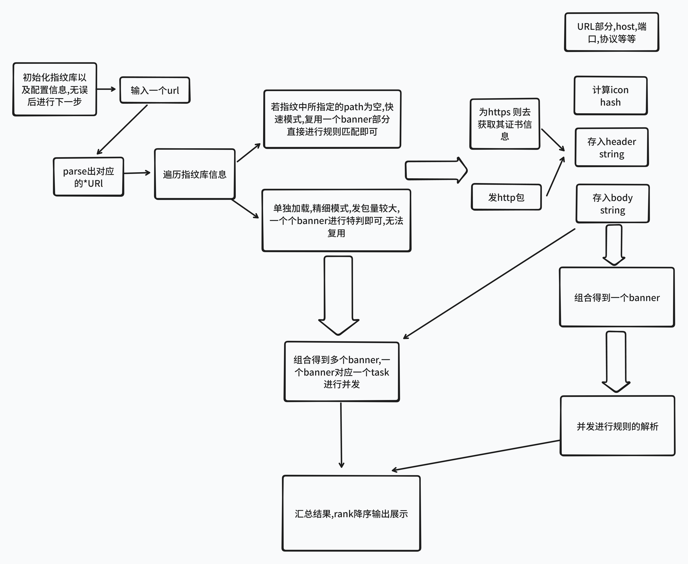
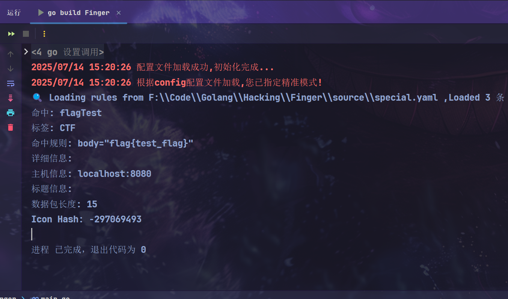

## 关于`PrintRaptor`

GPT 给起的名字哈

Print（指纹） + Raptor（迅猛，快速识别）

主打一个~~又快又猛~~

##  设计

想用`yaml`语法支持配置文件的加载,支持表达式语法解析(这部分AST不太会,可能写的很烂,凑合着吧~)

## 思考
YAML字段规范,主要还是参照现有的指纹库吧,将其格式改改也能用~

尽可能的压缩`yaml`的字段数了,提供该有的东西即可,毕竟web指纹这块一个是看有没有自己独有的判断路径和特征,如果要特别精确的识别一个系统也是比较困难,可能需要人工的经验积累,先有个大概探测吧~

PS: 为啥想采用`YAML`去解析呢,感觉还是后续方便指纹的添加和管理,再一个是看起来写起来都比较简易直观,后续也方便与`nuclei`联动!!!

又想起浪师傅的一句话了,`没有精准的指纹识别,后续的漏洞打击肯定是没意义的`,犹如大炮打蚊子

现有web指纹识别工具感觉已经挺厉害了,带路径扫描的好像还没看到有支持的,我来试试优化优化,刚好展示一下自己的屎山代码能力,好久没写代码了,锻炼锻炼~

## 举例

初始`yaml`格式模板如下:
```yaml
- name: flagTest # 该指纹的名字
  path: /flag.jsp # 对应的web路径,以根为主
  expression: body="flag{test_flag}" # 匹配关键字,暴露了哈~
  tag: flag测试 # tag 便于后续分类管理
```

采集的banner信息
```golang
type Banner struct {
	ResponseData *fingerprints.ResponseData //包含header,body,hash,用于指纹匹配
	CompiledRule *fingerprints.CompiledRule //加载的指纹识别规则
	BodyLength   string //包的大小
	Cert         string //tls证书信息
	Title        string //网站标题
	ICP          string //备案信息
	FoundDomain  string //域名信息
	FoundIP      string //ip信息
}
```



**快速模式**: 默认加载根路径的数据包(只发一次),加载多个指纹,对指纹解析过程作并发

**精细模式**: 加载特殊路径的指纹,一个指纹对应一个banner去解析,应该写成一个原子操作

## 使用指北

当前目录下放`config.yaml`文件,默认通过其加载配置完成初始化

给一份demo示例:

```yaml
# 添加可自定义的http header
ReqHeader:
  - Content-Type: application/xml
  - Cookie:
      'phpsessionid: "123"'
# 添加代理
Proxy:
  http://localhost:8000
# 添加超时时间
TimeOut: 1
# post请求的body,默认base64解码再使用,可以直接打反序列化链哦~
POST: 'dXNlcm5hbWU9YWRtaW4mcGFzc3dvcmQ9MTIzNDU2'
# 探测目标文件位置
TargetFilePath: 'F:\\Code\\Golang\\Hacking\\PrintRaptor\\source\\IP.txt'
# 指纹文件路径
FingerFilePath: 'F:\\Code\\Golang\\Hacking\\PrintRaptor\\source\\special.yaml'
FastMode: false
```



## TODO

1. 支持并发模式,这个得速度支持了,能大大提升效率
2. 日志库的编写(这部分也得速度支持了)
3. 根据rank的分值来显示程度,可以顺带用于简易poc扫描,rank分高一些
4. 支持json,csv,数据库导出
5. 添加资产关联?(终极目标之一)
6. 图形化,看板展示(审美不行~)

## 感谢 

1. https://github.com/0x727/FingerprintHub/tree/v3   yaml语法解析的指纹库
2. https://github.com/lcvvvv/appfinger/ 浪师傅的`kscan`模块嘿嘿,学习学习!!!手搓表达式解析,有点意思
3. `yakit`的指纹库